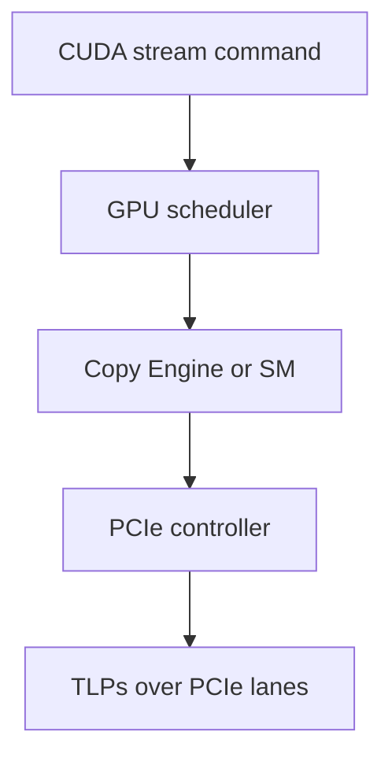
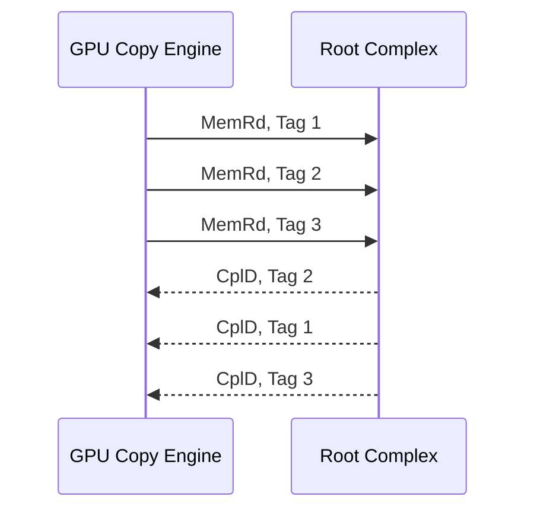

> 本文记录 CPU–GPU 数据传输中几个容易混淆的层次：CUDA stream、GPU Copy Engine、PCIe transaction、TLP、flow control 与可靠性。重点讨论 discrete GPU 通过 PCIe 与 host memory 通信的情况。

## 1. 首先建立分层认识

一次 CUDA 数据传输会经过多个层次，但各层解决的问题不同：

| 层次                              | 主要职责                                             | 典型对象                         |
| --------------------------------- | ---------------------------------------------------- | -------------------------------- |
| CUDA Runtime / Driver             | 接收 API、管理地址和依赖、提交命令                   | `cudaMemcpyAsync`、stream、event |
| GPU command processor / scheduler | 读取命令队列并选择执行资源                           | command queue、fence、semaphore  |
| Copy Engine                       | 执行大块 DMA copy                                    | `{src, dst, length}` descriptor  |
| PCIe Transaction Layer            | 将访问组织为 transaction                             | `MemRd`、`MemWr`、`CplD` TLP     |
| PCIe Data Link / Physical Layer   | hop-by-hop 可靠传输、flow control、lane transmission | credit、ACK/NAK、replay、lane    |



最重要的边界是：

- stream 是有序的逻辑工作序列，不是 PCIe channel，也不是独占 Copy Engine。
- Copy Engine 接收大块 DMA command，不直接等同于某个 PCIe lane。
- PCIe controller 才负责 TLP 划分、Tag、credit、ACK/NAK 和 replay。
- 所有跨 PCIe 的通信都会经过 PCIe controller，但不一定经过 Copy Engine。

一些缩写的全称和含义：

| 缩写     | English Full Name                      | 含义                                                                                                                             |
| -------- | -------------------------------------- | -------------------------------------------------------------------------------------------------------------------------------- |
| CE       | Copy Engine                            | GPU 中执行 bulk DMA copy 的硬件引擎。它接收 `{src, dst, length}` 等 descriptor，再由 PCIe controller 生成具体 TLP。              |
| BAR      | Base Address Register                  | PCIe configuration space 中描述 device address aperture 的寄存器，例如通过 BAR1 将部分 GPU memory 暴露给其他 PCIe participants。 |
| MMIO     | Memory-Mapped I/O                      | 将 device registers 或 memory aperture 映射到 CPU address space，使 CPU 可以通过 load/store 访问。                               |
| IOMMU    | Input–Output Memory Management Unit    | 对 device DMA address 进行地址翻译和访问保护，使 GPU 能通过 I/O virtual address 访问离散的 host physical pages。                 |
| TLP      | Transaction Layer Packet               | PCIe Transaction Layer 的 packet，承载 Memory Read、Memory Write 和 Completion 等 transaction。                                  |
| DLLP     | Data Link Layer Packet                 | PCIe Data Link Layer 的控制 packet，承载 ACK/NAK 和 flow-control update 等信息。                                                 |
| MemRd    | Memory Read Request                    | PCIe read request，属于 Non-Posted Request，必须通过 Completion 返回结果。                                                       |
| MemWr    | Memory Write Request                   | PCIe write request，属于 Posted Request，正常情况下没有逐请求 Completion。                                                       |
| Cpl      | Completion                             | 对 Non-Posted Request 的响应 TLP；不携带数据时通常记为 Cpl。                                                                     |
| CplD     | Completion with Data / Completion Data | 在 TLP 语境中表示携带数据的 Completion；在 credit 语境中表示 Completion Data Credit。                                            |
| RC       | Root Complex                           | 连接 CPU/memory subsystem 与 PCIe fabric 的根节点，负责枚举、配置和路由 PCIe transactions。                                      |
| DW       | Double Word                            | PCIe transaction 中的 32-bit 数据单位。TLP Length、alignment 和 Byte Enable 都经常以 DW 为基础。                                 |
| MPS      | Maximum Payload Size                   | 单个携带数据的 TLP 所允许的最大 payload，影响 `MemWr` 和 `CplD` 的拆分粒度。                                                     |
| MRRS     | Maximum Read Request Size              | Requester 的单个 `MemRd` 最多可以请求多少数据。它限制 request size，不保证数据由单个 `CplD` 返回。                               |
| RCB      | Read Completion Boundary               | Read Completion 的合法拆分边界。较大的 read request 可能按照 RCB、MPS 和 alignment 被拆成多个 `CplD`。                           |
| FC       | Flow Control                           | PCIe 基于 receiver buffer credit 的逐跳流量控制机制。                                                                            |
| PH       | Posted Header Credit                   | 用于接收 Posted TLP header 的 credit，例如 `MemWr` header。                                                                      |
| PD       | Posted Data Credit                     | 用于接收 Posted TLP payload 的 credit，例如 `MemWr` data。                                                                       |
| NPH      | Non-Posted Header Credit               | 用于接收 Non-Posted TLP header 的 credit，例如 `MemRd` request。                                                                 |
| NPD      | Non-Posted Data Credit                 | 用于接收携带 payload 的 Non-Posted TLP；普通 `MemRd` 通常不消耗 NPD。                                                            |
| CplH     | Completion Header Credit               | 用于接收 Completion TLP header 的 credit。                                                                                       |
| CplD     | Completion Data Credit                 | 在 flow-control 语境下，表示用于接收 Completion payload 的 credit。                                                              |
| InitFC1  | Initialize Flow Control Phase 1        | link 初始化期间，receiver 第一次通告各类 receive-buffer credits。                                                                |
| InitFC2  | Initialize Flow Control Phase 2        | 确认双方已获得初始 credit 信息，完成 flow-control 初始化。                                                                       |
| UpdateFC | Update Flow Control                    | receiver 运行期间发布累计 credit 状态的 DLLP，用于归还已经释放的 buffer space。                                                  |
| LCRC     | Link Cyclic Redundancy Check           | 对单条 PCIe link 上的 TLP 进行错误检测；每经过一个 switch hop 都会重新检查和生成。                                               |
| ECRC     | End-to-End Cyclic Redundancy Check     | 可选的端到端 TLP integrity check；用于发现 switch 或其他中间组件内部造成的数据损坏。                                             |
| FEC      | Forward Error Correction               | 高速 PCIe Physical Layer 使用的前向纠错机制，用冗余编码修复一定范围内的 bit errors，减少 replay。                                |

---

## 2. GPU Copy Engine 在 PCIe 上是不是“多路”的？

“多路”可能指三种不同的并行性，必须分别讨论。

### 2.1 多个 Copy Engine

GPU 可能包含多个 Copy Engine，因此可以在硬件资源允许时并行执行：

- H2D copy；
- D2H copy；
- D2D/P2P copy；
- copy 与 kernel execution。

但 Copy Engine 的数量不等于 CUDA stream 的数量。大量 streams 会被 multiplex 到有限的 engines 上。同方向的多个 copy 即使能够并发排队，也通常共享同一 PCIe link 和 memory subsystem 带宽。

设备暴露的 `asyncEngineCount` 可以帮助判断其异步 copy 能力，但不能直接推导出任意方向组合都能完全并行，也不能说明每个 stream 都获得独占 engine。

### 2.2 PCIe full-duplex

一条 PCIe link 在两个方向上分别有独立的 differential pairs，因此可以同时双向传输。例如 H2D data 和 D2H data 可以在物理链路上同时流动。

这不代表两个方向完全没有其他共享瓶颈：Copy Engine、GPU memory bandwidth、Root Complex、switch、NUMA path 和 host memory bandwidth 仍可能产生竞争。

### 2.3 PCIe multi-lane

PCIe x16 由 16 条 lanes bonding 成一条 logical link。它不是 16 条可以由软件分别选择的 memcpy channel。

一个 TLP 会在 link level 被 striping 到所有 active lanes 上；接收端通过 lane alignment 和 deskew 恢复原始数据。软件通常不能指定“这个 copy 走 lane 0，另一个 copy 走 lane 1”。

因此，PCIe 上的并行性更准确地说是：

1. lane-level parallel transmission；
2. full-duplex transmission；
3. transaction-level concurrency，即同时存在多个 outstanding transactions。

### 为什么 PCIe 这样设计

- **可扩展**：同一套协议可训练为 x1、x4、x8、x16 等宽度。
- **统一调度**：一条 logical link 统一处理 ordering、flow control、replay 和 error recovery。
- **避免 channel fragmentation**：所有 lanes 能共同服务当前 traffic，而不是把 bandwidth 固定切成若干独立小通道。
- **适合 switch fabric**：packetized TLP 可以被 PCIe switch 根据地址和 routing information 转发。
- **支持并发隐藏延迟**：通过多个 outstanding requests 维持流水线，而不是等待一个 transaction 完成后再发送下一个。

---

## 3. outstanding read 是什么？

一个 outstanding read 指：Requester 已经发出了 `MemRd`，但对应数据的 Completion 还没有全部返回。

以典型 H2D DMA 为例，GPU Copy Engine 是 PCIe bus master：

1. GPU 向 Root Complex 发出多个 `MemRd` requests，请求读取 host memory；
2. 每个 request 分配一个 Tag；
3. Root Complex 返回一个或多个 `CplD`；
4. GPU 根据 Requester ID、Tag、address/byte count 等信息匹配 Completion；
5. 对应 request 的全部数据返回后，该 Tag 才能被复用。



Completion 不必按照 request 发出顺序返回；Tag 允许接收端正确匹配它们。

### 为什么必须允许多个 outstanding reads

PCIe read 是 request-response transaction。如果每次只允许一个 request：

```text
发请求 → 等待 round-trip latency → 收到数据 → 再发下一个
```

链路大部分时间都会空闲。为了跑满带宽，至少需要满足 bandwidth-delay product：

$$

\text{Required outstanding bytes}
\approx \text{Link bandwidth}\times\text{round-trip latency}


$$

例如有效带宽为 25 GB/s、round-trip latency 为 1 μs：

$$

25\ \text{GB/s}\times 1\ \mu s \approx 25\ \text{KB}


$$

若每个 read request 为 512 B，则至少需要约：

$$

25\ \text{KB}/512\ \text{B}\approx49


$$

个 requests 同时 outstanding，才能仅从理论上覆盖这段 latency。实际还会受到 Tag 数量、Completion buffer、credit、Root Complex 和 memory latency 等限制。

---

## 4. TLP 很小会不会降低 I/O 效率？

会，但 PCIe 通过较大的 payload 和大量并行 TLP 来摊薄 overhead。

一个 data TLP 除 payload 外，还包含 TLP header、LCRC，并承担 Physical Layer encoding、framing、DLLP 等开销。简化估算可以写为：

$$

\eta \approx
\frac{\text{payload}}
{\text{payload}+\text{header}+\text{LCRC}}


$$

若使用 16 B header 和 4 B LCRC，并暂时忽略其他开销：

| Payload | 简化效率 |
| ------: | -------: |
|    64 B |    76.2% |
|   128 B |    86.5% |
|   256 B |    92.8% |
|   512 B |    96.2% |
|  1024 B |    98.1% |

因此，几百 bytes 的 payload 并非特别低效；真正容易损害效率的是大量 4 B、8 B、32 B 等小而随机的 transactions。上表也没有计入 ACK/NAK DLLP、UpdateFC、encoding/FEC、read request 和方向切换等开销，所以不是最终 wire efficiency。

### 大块 copy 如何划分成 TLP

应用提交的几 MB 或几 GB `cudaMemcpyAsync` 会先成为一个或多个 DMA descriptors，再由 PCIe controller 继续拆分为 TLP。主要约束包括：

#### MPS：Maximum Payload Size

限制一个携带数据的 TLP 最多包含多少 payload，例如 128 B、256 B 或 512 B。`MemWr` 和 `CplD` 都会受到相关 MPS 限制。

#### MRRS：Maximum Read Request Size

限制一个 `MemRd` request 最多请求多少数据，例如 512 B。MRRS 控制 request 范围，不意味着这些数据一定通过单个 `CplD` 返回。

#### 4 KB boundary

PCIe Memory Request 不能跨越 4 KB address boundary。如果一个连续区域跨越该边界，必须拆成多个 requests。

#### Byte Enable

TLP header 中的 First/Last DW Byte Enable 描述首尾 DWORD 中哪些 bytes 有效，因此 PCIe 能表达非 DWORD 对齐或非 DWORD 倍数的访问。

#### RCB：Read Completion Boundary

RCB 约束 Completer 在哪些边界上拆分 Completion。一个较大的 `MemRd` 可能返回多个 `CplD`；拆分同时受 request size、MPS、RCB、alignment 和 Completer 实现影响。

例如，假设：

- H2D copy 为 4 KB；
- MRRS = 512 B；
- Completion payload 上限为 256 B。

则可以概念性地形成 8 个 512 B `MemRd` requests，而每个 request 又由两个 256 B `CplD` 返回，共 16 个 data Completions。实际划分还取决于起始地址和 RCB。

需要区分两级 segmentation：

- Driver/Copy Engine 将一次大 copy 划分为 DMA descriptors；
- PCIe controller 将 descriptor 对应的访问划分为 TLP。

用户通常不需要把大 `cudaMemcpyAsync` 手工切成几百 bytes；这种切分反而会增加 API、command submission 和 scheduling overhead。

---

## 5. PCIe 是有可靠性保证的传输协议吗？

是，但它提供的是有限作用域的硬件可靠性，而不是“任何故障下都保证最终成功”。

### Data Link Layer 的 hop-by-hop 可靠性

每一段 PCIe link 都独立执行：

- TLP Sequence Number；
- LCRC error detection；
- ACK/NAK DLLP；
- Replay Buffer；
- Replay Timer。

如果接收端发现 LCRC 错误或 sequence 异常，可以通过 NAK 或 timeout 触发发送端 replay。只有当 TLP 被下一跳正确接收并 ACK 后，发送端才能从 replay buffer 中释放对应记录。

如果路径中存在 PCIe switch：

```text
GPU ↔ Switch ↔ Root Complex
```

GPU–Switch 和 Switch–Root Complex 是两条分别保证可靠性的 links。ACK 只表示下一跳 Data Link Layer 正确接收，并不表示最终数据已经写入 DRAM，更不表示软件已经处理完成。

### Transaction Layer 的完成语义

- `MemRd` 属于 Non-Posted Request，最终必须收到 Completion；Requester 还可以检测 Completion Timeout、Unsupported Request 等错误。
- `MemWr` 属于 Posted Request，不为每次 write 返回 Completion，因此不存在“每笔 write 的端到端成功响应”。
- ECRC 可以提供可选的 end-to-end TLP integrity detection；LCRC 只覆盖单条 link。

因此 PCIe 能恢复常见 transient link error，但对 link down、设备 reset、uncorrectable error、路由失败和硬件故障等情况，只能上报错误，不能保证 transaction 最终完成。

---

## 6. PCIe 和 TCP 的可靠性有何异同？

两者都使用了 sequence、error detection、ACK、timeout、retransmission 和 flow control，因此机制表面相似；主要区别在保证范围和设计环境。

| 维度         | PCIe                                          | TCP                                        |
| ------------ | --------------------------------------------- | ------------------------------------------ |
| 服务对象     | TLP / memory transaction                      | ordered byte stream                        |
| 可靠性范围   | 每条 physical link hop-by-hop                 | 两个 transport endpoints end-to-end        |
| 网络环境     | 受控的机内 point-to-point fabric              | 可能丢包、乱序、拥塞的 IP network          |
| 确认含义     | 下一跳正确接收 TLP                            | 远端 TCP stack 已接收相应 bytes            |
| 流量控制     | per-hop credit-based flow control             | receiver advertised window                 |
| 拥塞控制     | 没有 TCP 式动态 congestion window             | slow start、congestion avoidance 等        |
| 上层可见顺序 | 按 PCIe ordering rules，可允许部分 reordering | 向应用提供 ordered byte stream             |
| 典型恢复粒度 | replay 某段 link 上的 TLP                     | sender 根据 ACK/SACK 和 timer 重传 segment |

两者的 ACK 都不表示 application 已经消费数据：

- TCP ACK 不代表 remote application 已经读取 socket；
- PCIe ACK 不代表目标 CPU/GPU 或 DRAM 已经完成更高层语义。

PCIe 不需要 TCP 式 congestion control，是因为 transmitter 在发送 TLP 前已经通过 credit 确认下一跳存在接收 buffer，并且每段 link 是受控、独占的 point-to-point connection。

---

## 7. PCIe credit 如何同步更新？为什么不会失效？

PCIe 使用 receiver-advertised、per-hop、per-traffic-class buffer credit。它不是 sender 每发一个 TLP就等待 receiver 单独回复一个 credit。

### Credit 分类

基础情况下分为六类：

| Transaction 类别 | Header credit | Data credit |
| ---------------- | ------------- | ----------- |
| Posted           | PH            | PD          |
| Non-Posted       | NPH           | NPD         |
| Completion       | CplH          | CplD        |

一个 TLP 消耗一个对应的 Header credit。传统 flow-control 编码中，一个 Data credit 对应 16 B payload buffer；不同类别不能随意互相借用。

这种分类避免一种 traffic 把全部 receive buffer 占满。例如 Posted Writes 不能消耗掉专门为 Completions 保留的全部空间，否则可能形成 protocol deadlock。

### 初始化

link initialization 时，receiver 使用 `InitFC1/InitFC2` DLLP 告知 transmitter：自己愿意为各种 TLP 类型提供多少 receive-buffer credits。

这些 credits 必须由真实、预留的 receiver buffer 支撑。Transmitter 在发送前由硬件检查对应 credit 是否足够；不足时该类 TLP必须等待。

### 运行时更新

当一个 TLP 被完整接收后，它会占用 receiver buffer。只有当 receiver 将该 TLP 从 flow-control-controlled buffer 中移出、对应空间真正可重用时，才能归还 credit。

receiver 通过 `UpdateFC` DLLP 发布累计的 `Credit Allocated`，transmitter 同时维护自己的累计 `Credit Consumed`。概念上：

$$

\text{Available Credit}
=\text{Credit Limit}-\text{Credit Consumed}


$$

协议字段以有限位宽的计数器循环工作，硬件按协议规定的 modulo 关系比较和更新。

关键点是 `UpdateFC` 传递的是累计状态，不是“本次增加了多少”的不可重复 delta。因此：

- 重复收到同一个 UpdateFC 不会重复加 credit；
- 某个 UpdateFC 丢失或损坏时，sender 只会暂时低估 available credit；
- 后续周期性 UpdateFC 会携带更新后的累计值，使 sender 追上最新状态。

这种错误倾向于造成保守停顿，而不是让 sender 高估 receiver buffer 并造成 overflow。

### Credit 有效性的保障

1. credit 由 receiver 根据真实 buffer capacity 发布；
2. transmitter 在 TLP 发出前进行硬件检查并预扣 credit；
3. receiver 只在 buffer 实际释放后归还 credit；
4. UpdateFC 使用累计、幂等的状态更新；
5. DLLP 自身带 CRC，损坏的 flow-control update 不会直接采用；
6. protocol violation 可以通过 Data Link/PCIe error reporting 检测；
7. credit 是 per-hop 的，switch 在每个 ingress/egress link 上独立实施 backpressure。

### 放到 GPU copy 路径中理解

对于典型 discrete GPU：

- H2D：GPU 发出 `MemRd`，消耗 Root Complex 的 NPH；返回的 `CplD` 消耗 GPU 接收侧的 CplH/CplD。
- D2H：GPU 发出 Posted `MemWr`，消耗 Root Complex 的 PH/PD。

Credit 决定“下一跳能不能接收 TLP”；Tag 和 Completion buffer 则限制“能有多少 read requests 同时 outstanding”。两者相关，但不是同一个机制。

---

## 8. CUDA stream 如何异步提交 copy？

`cudaMemcpyAsync()` 的核心不是“CPU 异步产生每个 PCIe TLP”，而是将 command submission 与 command execution 分离。

以 pinned host memory 的 H2D copy 为例：

1. CUDA Runtime 调用 Driver；
2. Driver 判断 pointer 类型和 copy direction，查找 GPU virtual address 与 DMA/IOMMU mapping；
3. Driver 生成包含 source、destination、length、direction 等信息的 DMA command；
4. command 被加入与 stream 相关的 command sequence；
5. Driver 更新 command queue/pushbuffer，并通过 doorbell/MMIO 等机制通知 GPU；
6. GPU scheduler 等待该 command 之前的 stream dependencies 完成；
7. command 被分配给 Copy Engine；
8. Copy Engine/PCIe controller 生成 `MemRd`、`MemWr`、`CplD` TLP；
9. copy 完成后 GPU 更新 fence、semaphore 或 event state；
10. 同一 stream 的后续 command 才能继续，等待该 event/stream 的 CPU thread 也可以被唤醒。

具体 command packet、queue 和 doorbell 格式属于 NVIDIA Driver/GPU generation/OS 的实现细节，不是 CUDA API 的稳定 ABI。Driver 也可能 batch 多条 commands 以降低 submission overhead。

### API 返回代表什么

`cudaMemcpyAsync()` 返回通常只表示请求已经被 CUDA 接收并排入执行序列，不表示：

- Copy Engine 已经开始执行；
- PCIe TLP 已经发出；
- 数据已经到达目标 memory。

真正的完成状态需要通过：

- `cudaEventQuery` / `cudaEventSynchronize`；
- `cudaStreamQuery` / `cudaStreamSynchronize`；
- 或后续 stream dependency。

“Async”也不意味着 API 调用绝不阻塞。lazy initialization、queue backpressure、resource allocation、pageable-memory staging 等都可能让调用产生额外 host-side latency。

### 为什么 pinned memory 是关键

GPU 可能在 API 返回之后才访问 host buffer，因此这些页面必须：

- 不能被 OS swap/move；
- 在 DMA 完成前保持有效；
- 保持稳定的 DMA/IOMMU mapping。

`cudaMallocHost` 和 `cudaHostRegister` 用于建立这种 page-locked memory。

若使用普通 pageable memory，Driver 可能采用：

```text
pageable memory → internal pinned staging buffer → PCIe DMA → VRAM
```

这会引入一次 CPU copy，并可能导致 host-side synchronization。CUDA 对 pageable memory 的具体阻塞行为保留实现空间；如果目标是真正的异步 H2D/D2H overlap，应使用 pinned memory。

---

## 9. UVA direct access 是否需要 Copy Engine？

不一定。UVA 只统一 virtual address space，使 CUDA 能从 pointer 判断 memory location，并允许某些 memory 通过同一个地址被相应 processor 访问。它本身不规定数据如何移动。

### `cudaMemcpyDefault`：UVA 只用于识别方向

```cpp
cudaMemcpyAsync(dst, src, bytes,
                cudaMemcpyDefault, stream);
```

这里 UVA 让 Driver 自动判断 H2D、D2H 或 D2D。它仍然是显式 copy，连续大块传输通常由 Copy Engine 执行。`cudaMemcpyDefault` 不是 zero-copy。

### mapped pinned memory / zero-copy：SM 直接访问 host memory

```cpp
float *p;
cudaHostAlloc(&p, bytes, cudaHostAllocMapped);
kernel<<<grid, block>>>(p);
```

GPU kernel 直接 load/store mapped host memory 时，路径是：

```text
SM load/store → GPU memory subsystem/L2 → PCIe controller → host memory
```

- GPU load 通常触发 PCIe `MemRd`，数据通过 `CplD` 返回；
- GPU store 通常触发 PCIe Posted `MemWr`；
- 这些 requests 源于 SM memory instructions，而不是 Copy Engine DMA command。

“Zero-copy”表示没有先把整个 buffer staging 到 VRAM，不表示没有 PCIe traffic。

### Unified Memory：可能迁移，也可能 remote access

Unified Memory 管理 memory residency 和 coherence，和 UVA 不是同一概念。根据平台与当前 residency，访问可能导致：

- page fault 后通过 DMA/Copy Engine 迁移页面；
- `cudaMemPrefetchAsync` 提前迁移；
- 在支持相应能力的平台上直接 remote access。

因此，Managed Memory 不能简单归类为“一定使用”或“一定不使用”Copy Engine。

### CPU–GPU 通信路径总结

| 操作                               | 主要发起者                   |    是否需要 Copy Engine |
| ---------------------------------- | ---------------------------- | ----------------------: |
| `cudaMemcpyAsync` H2D/D2H          | 通常为 Copy Engine           | 通常使用，但 API 不保证 |
| Kernel 访问 mapped host memory     | SM load/store unit           |                      否 |
| CPU 访问 GPU BAR/MMIO              | CPU load/store               |                      否 |
| CPU 提交 command/写 doorbell       | CPU                          |                      否 |
| GPU 更新 host-side fence/semaphore | GPU memory/command subsystem |                  不一定 |
| Unified Memory page migration      | UVM + DMA                    |                可能使用 |
| Unified Memory direct access       | CPU或SM load/store           |                      否 |
| PCIe ACK/NAK、credit、interrupt    | PCIe/Data Link logic         |                      否 |

### 任意 byte 的访问

CPU/GPU 可以在程序语义上访问单个 byte，但实际 PCIe traffic 的粒度通常更大：

- TLP 使用 Byte Enable 表达首尾有效 bytes；
- GPU memory subsystem 可能先按 warp 合并 requests；
- cache sector/cache line 可能放大一次 load 的实际传输量；
- TLP header 和 link overhead 不会随有效数据量同比缩小。

因此，支持 byte-granularity 不等于传一个 byte 只消耗一个 byte 的链路资源。大量随机小访问会造成 bandwidth amplification，并受到 PCIe latency 限制。

### Copy Engine 与 direct access 的选择

适合 Copy Engine：

- 连续大块数据；
- 数据会在 GPU 上重复访问；
- 需要接近 PCIe peak bandwidth；
- 需要 copy 与 kernel overlap；
- 希望后续使用 GPU DRAM bandwidth。

适合 mapped zero-copy/direct access：

- 少量 control data、flag、queue metadata；
- 数据只被访问一次或只访问很小一部分；
- 访问能够 coalesce；
- 不希望先复制整个 buffer。

可以概括为：

> Copy Engine 是“先批量搬到本地，再快速反复访问”；zero-copy 是“不预搬运，但每次访问都可能跨 PCIe”。

---

## 10. 容易混淆的结论

1. **PCIe x16 不是 16 个独立 copy channels**：它是一条由 16 lanes bonding 的 logical link。
2. **stream 不等于 Copy Engine**：stream 表达 ordering；多个 streams 共享有限的 hardware engines。
3. **outstanding read 不等于线程并发**：它是尚未收到全部 Completion 的 PCIe read transaction。
4. **TLP 小不代表大 copy 低效**：大 copy 会形成大量流水化 TLP；真正低效的是大量小而随机的 accesses。
5. **PCIe ACK 不是最终业务完成**：它只确认下一跳正确收到 TLP。
6. **credit 不是可靠性 ACK**：credit 防止 receiver-buffer overflow；ACK/NAK + replay 处理 link transmission error。
7. **UVA 不等于 Unified Memory**：前者统一 address space，后者管理 residency/coherence。
8. **UVA 不等于 zero-copy**：`cudaMemcpyDefault` 使用 UVA 识别方向，但仍是显式 copy。
9. **zero-copy 不等于零 PCIe traffic**：只是取消预先 staging，kernel 的 load/store 仍跨 PCIe。
10. **CPU–GPU 通信不都经过 Copy Engine**：但跨 PCIe 的 traffic 都必须经过 PCIe controller。

---

## 11. 用于性能分析的检查顺序

遇到 CPU–GPU I/O 性能问题时，可以依次确认：

1. 当前使用的是 explicit copy、mapped zero-copy，还是 Unified Memory migration？
2. host memory 是否 pinned？是否存在 pageable staging？
3. Copy Engine 是否与 compute 或另一个 copy direction 并行？
4. 多个 streams 是否最终竞争同一 Copy Engine、PCIe link 或 memory subsystem？
5. PCIe link 实际训练到的 generation 和 width 是多少？
6. traffic 是大块连续 transfer，还是大量小粒度 remote accesses？
7. H2D read path 是否有足够 outstanding bytes、Tags 和 Completion credits？
8. D2H write path 是否受到 PH/PD credits 或 Root Complex buffer 限制？
9. NUMA placement 是否使 host memory 位于远端 socket？
10. 测量的是 API submission latency、DMA duration，还是应用可见 completion latency？

这个顺序能避免把上层 stream scheduling、Copy Engine contention 和底层 PCIe flow control 混成同一个问题。

---

## 参考资料

- [NVIDIA CUDA Programming Guide：Asynchronous Execution](https://docs.nvidia.com/cuda/cuda-programming-guide/02-basics/asynchronous-execution.html)
- [NVIDIA CUDA Runtime API：API Synchronization Behavior](https://docs.nvidia.com/cuda/cuda-runtime-api/api-sync-behavior.html)
- [NVIDIA CUDA Best Practices Guide：Zero Copy 与 UVA](https://docs.nvidia.com/cuda/cuda-c-best-practices-guide/index.html)
- [NVIDIA CUDA Programming Guide：Unified Memory](https://docs.nvidia.com/cuda/cuda-programming-guide/04-special-topics/unified-memory.html)
- [NVIDIA CUDA Driver API：Unified Addressing](https://docs.nvidia.com/cuda/cuda-driver-api/group__CUDA__UNIFIED.html)
- [Intel PCIe IP Documentation：Flow Control Update Loop](https://docs.altera.com/r/docs/683733/18.0/arria-v-avalon-st-interface-for-pcie-solutions-user-guide/throughput-optimization)
- [Intel PCIe IP Documentation：Flow Control Credit Handling](https://docs.altera.com/r/docs/790711/26.1/axi-streaming-ip-for-pci-express-user-guide/flow-control-credit-handling)
- [Intel PCIe IP Documentation：Data Link Layer](https://docs.altera.com/r/docs/683093/current/data-link-layer)
- [TCP Specification：RFC 9293](https://www.rfc-editor.org/rfc/rfc9293)
- [TCP Congestion Control：RFC 5681](https://www.rfc-editor.org/rfc/rfc5681)
